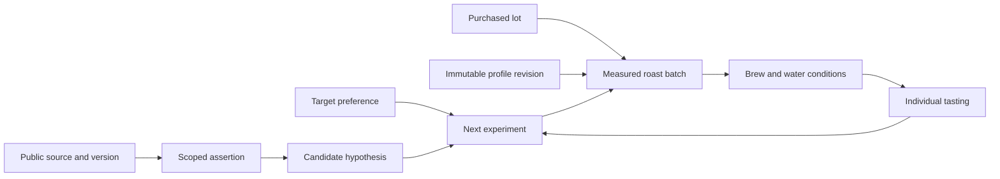

# Dialed knowledge and learning strategy

Working design and public seed, 17 September 2026.

Implementation update, 18 September: the [brew/equipment capture layer and nine-batch pilot planner](BREWING.md) are now implemented locally. The roadmap below records the original strategy; richer lot metadata, source ingestion and predictive learning remain future work.

**The defensible asset is a growing set of linked, reproducible coffee experiments.** Public information supplies starting hypotheses; our own observations teach us which choices work for a particular coffee, equipment and person. RAG helps retrieve and explain evidence. It cannot, by itself, predict the result of an untested roast.

Define success as **fewer trials to an accepted cup**, measured separately in roast batches, brew attempts, grams consumed and elapsed days. “Zero-shot” means a useful first recommendation before a local calibration trial; it does not mean guaranteed taste. Some target flavours may be unavailable from the chosen coffee. A recommendation should be able to suggest changing the bean.

## 1. The data product

Maintain three connected collections:

1. **Reference knowledge:** varieties, processing definitions, equipment documentation, protocols, research findings and public recipes. Each assertion has a source, scope, date and evidence type.
2. **External reported cases:** a particular vendor offer, community roast, competition recipe or published comparison. Preserve what was actually reported and which parts of the chain are missing. Vendor descriptors are claims; upvotes are not experimental replication.
3. **Dialed experimental cases:** immutable links between a purchased green lot, profile revision, actual roast, rest/storage, brew and individual sensory assessments. Include failed attempts, abandoned trials and deviations from the plan.

Never join different examples into a purported observed chain. A vendor's Sidamo description plus a generic roast profile plus a V60 recipe is a proposed experiment, not an observed successful case. A repeating product URL can describe different harvests; it is not a permanent lot identifier.

## 2. Capture contract

Keep original labels alongside canonical values. Numbers have explicit units and measurement methods. Distinguish **unknown**, **not measured**, **not applicable**, **estimated** and **reported by someone else**; never encode absence as zero. Preserve uncertainty intervals, precision and measurement timestamps where available. The current seed uses null plus limitations; production should add per-field missingness reasons.

| Entity              | Required for an interpretable case                                                                                                                     | Extended measurements                                                                                                                                                                                                                                                                                                                 |
| ------------------- | ------------------------------------------------------------------------------------------------------------------------------------------------------ | ------------------------------------------------------------------------------------------------------------------------------------------------------------------------------------------------------------------------------------------------------------------------------------------------------------------------------------- |
| Green lot           | Internal ID; supplier and supplier lot ID if known; harvest; country/region/producer; original variety and process labels; receipt date                | Farm/plot/coordinates when appropriate; species; variety identity confidence; blend components and proportions; altitude; screen distribution; bulk density with protocol; moisture and water activity with instrument/date; defects; storage temperature/humidity; packaging; age                                                    |
| Processing          | Primary process and source of information                                                                                                              | Ordered stages: cherry/pulp/parchment state, duration, temperature, oxygen regime, pH, inoculum, added material/co-fermentation, washing, drying method/endpoints; decaffeination method as a separate axis                                                                                                                           |
| Profile revision    | ID, parent revision, author/source, content hash, native format/version, compatible device, original file                                              | Every native setting, curve/control point, fan/heat instruction, preheat/start conditions, termination rules, level-to-temperature mapping, boost configuration; unknown native fields retained losslessly                                                                                                                            |
| Roast execution     | Lot and exact profile revision; device unit/model/firmware; operator; timestamp; charge/output masses; duration; actual selected level; deviations     | Measured time series and channel units, sensor placement/calibration, fan/power/voltage, ambient conditions, first-crack event and detection method, yellowing, finish, cooling, whole/ground colour and measurement system, weight loss, RoR smoothing method                                                                        |
| Rest/storage        | Roast-to-brew age in hours; packaging and opening history                                                                                              | Storage temperature, freezing/thawing history, degassing conditions; distinguish harvest age, green-storage age and roast age                                                                                                                                                                                                         |
| Brew execution      | Roast ID; method; brewer model; grinder model/burrs and setting; dose; input water and beverage output separately; temperature location; timing origin | Grinder unit/zero/axle/RPM, seasoning/retention/purge; basket/filter model and material; kettle; pressure/flow/temperature traces; preinfusion; pour schedule/agitation; distribution/tamping; bypass; dilution/milk; water source, calcium/magnesium, hardness/alkalinity with basis, pH; TDS instrument/calibration/sample handling |
| Sensory assessment  | Brew ID; taster; blind sample code; protocol/version; descriptor and intensity; overall liking; target match; serving temperature                      | Acidity quality vs intensity, sweetness, bitterness, astringency, body, finish, defects; confidence; replicate; pairwise preference; free text in original language; fatigue/context                                                                                                                                                  |
| Experiment/decision | Target, constraints, candidate options, chosen intervention, baseline, budget, outcome                                                                 | Recommendation/model version, retrieved evidence IDs, predicted outcome/uncertainty, accepted/rejected rationale, controlled variables, allocation/randomization, failures, deviations, stopping rule                                                                                                                                 |

A cupping session is one brewing/assessment protocol, not a synonym for every tasting. An espresso served with milk and a standard immersion cup need separate context. Follow SCA's distinction between sensory description and preference; record the standard/version actually followed rather than labelling arbitrary 0–100 scores “SCA”. [CVA framework](https://sca.coffee/value-assessment).

Do not transfer grinder clicks between brands, units, burr sets or standard/Red Clix axles. Do not equate roast level 3, endpoint temperature or “light” between profiles and roasters. Store water hardness and alkalinity independently. Derive extraction yield only when the method and measurement support it; the usual beverage mass × TDS fraction / dry dose calculation has limitations for immersion, bypass and retained liquid.

The Kaffelogic guide itself demonstrates profile-dependent level semantics. Preserve its documentation context with the actual profile revision. [Manufacturer guide](https://www.kaffelogic.com/pages/profiles).

## 3. Storage and integration with today's app

The existing app already has beans, profile versions, roasts, cuppings, experiments and a hashed original-file archive. Local SQLite stores JSON entities; cloud storage uses Supabase. Keep those foundations.

**Immediate migration priorities:**

1. Extend bean records into explicit purchased lots with harvest and supplier identity. Retain the current origin/process/variety text without silently rewriting it.
2. Add `equipment_units`, `water_batches` and `brew_runs`. Link multiple sensory assessments to a brew. Legacy cuppings should acquire an explicit “brew conditions unknown” relationship, never fabricated recipes.
3. Version sensory scales; make unmeasured dimensions nullable. Current `cuppingSchema` requires numeric scores and does not capture a brew. Preserve legacy scale semantics during migration.
4. Link knowledge sources/assertions to experiment decisions. Keep sample notebook data tagged and exclude it from training and evaluation.

Recommended production tables: `sources`, `source_versions`, `assertions`, `assertion_entities`, `external_cases`, `coffee_lots`, `profile_versions`, `roast_runs`, `equipment_units`, `water_batches`, `brew_runs`, `sensory_assessments`, `experiment_decisions`, and `retrieval_chunks`. Use foreign keys and immutable event/version IDs for the experimental chain. An assertion holds predicate/value/unit, context, evidence locator, extraction method/version, review status and supersession links.

Use PostgreSQL for shared structured data and filtering, object storage for permitted original files and time series, and a rebuildable search index. Start with text search; add embeddings when they beat the baseline. A separate graph database is unnecessary initially: relational edges cover the required provenance and relationships.

Scope private cases to the workspace/team using existing authentication and row-level access controls. Retrieval must enforce that scope before ranking. Public assertions may be shared; private tasting history and preferences must not enter a shared index by accident. Log who can contribute, correct, export or withdraw records.

The implementation in this change is an **isolated research corpus and CLI**. It does not migrate the live notebook, deploy anything, implement embeddings, or train a taste predictor.

## 4. Public acquisition strategy

Prioritize information that completes useful cases rather than maximizing page count.

| Priority | Sources                                                             | Extract                                                                         | Acquisition plan                                                                   |
| -------- | ------------------------------------------------------------------- | ------------------------------------------------------------------------------- | ---------------------------------------------------------------------------------- |
| 1        | Purchased-bag metadata, supplier specifications, own Studio exports | Exact lot properties and native profile/log data                                | User-owned exports plus supplier feeds; strongest identity links                   |
| 1        | Kaffelogic official documentation and downloads                     | Settings semantics, compatibility, profiles                                     | Versioned official files and hash-based deduplication; verify in Studio            |
| 1        | Roast Rebels and other vendors/exporters                            | Offer/harvest snapshots, physical properties, processing and vendor descriptors | Supplier-specific parsers; keep offer separate from purchased lot                  |
| 2        | World Coffee Research                                               | Variety identities, aliases and lineage                                         | Curated taxonomy, then permission-compatible catalog ingestion                     |
| 2        | SCA and research publishers                                         | Protocol metadata and bounded findings                                          | Link protocol versions; use licensed/open data where available                     |
| 2        | Brewer manufacturers and recipe authors                             | Machine-specific recipes and exact units                                        | Structured recipe extraction including unspecified fields                          |
| 3        | Kaffelogic community, Home-Barista, Reddit                          | Reported settings, comparisons, failure modes and outcomes                      | Target complete cases, preserve thread/post context, review attachments and rights |

The first seed spans WCR, Sweet Maria's, Roast Rebels, COFI Traders, Kaffelogic, Origin Coffee, La Marzocco, AeroPress, SCA and Barista Hustle. Forum and Reddit leads are recorded separately. Full access to the Kaffelogic core-profile thread returned 403, so no attachment or detailed result has been claimed from that fetch.

**Publicly readable does not establish permission for bulk reuse.** Save a source-specific policy covering retrieval, text retention, embeddings, redistribution and model training. The seed contains short authored summaries/factual fields and links, not copied articles; its source licenses and commercial redistribution rights are explicitly unestablished. Reddit's API terms specify a separate agreement for commercial use. [Reddit Data API terms](https://redditinc.com/policies/data-api-terms). Resolve access/rights for each connector before unattended ingestion; do not bypass login, blocks or limits. No bulk crawler is included in this seed.

Pipeline: discover URL → check source access policy → fetch under permitted access → record retrieval outcome/version → retain permitted source artifact → extract to staging → validate units/identity → deduplicate → review → publish assertions → rebuild affected chunks. Record blocked/removed pages without silently substituting search snippets for a verified full document.

For scalable ingestion, every run needs an ID, counts by source/status, retries with backoff, explicit rate limits, content hashes, parser version and a quarantine queue. Detect template changes and unusual missingness. Initially review every numeric setting and every lot join. Then audit a sample of stable parsers while continuing full review of high-impact conflicts.

Refresh vendor offers weekly during active sourcing, documentation when versions change, and taxonomy quarterly; these are proposed cadences, not scheduled jobs. Keep historical snapshots. Mark a deleted or withdrawn source and remove its derived chunks from the next index build. Retention and downstream deletion should also cover embeddings, caches and any training datasets.

Do not multiply confidence when five sites repeat the same origin. Track primary attribution and duplicate lineage. A newer page may supersede an older recommendation, but it does not retroactively change historical roast conditions.

## 5. Retrieval and recommendation

Represent a target using method, desired descriptors, intensity ranges, dislikes and relative importance, plus equipment, available beans, time and coffee budget. Start with five intensity sliders and optional descriptors/pairwise examples; ask for more fields only when they change a decision.

Recommended pipeline:

1. Resolve exact lot, device and profile identities. Filter by equipment compatibility, private-data scope and method.
2. Retrieve both structured nearest cases and relevant reference assertions. Prefer exact-lot/device observations; back off to similar physical/process conditions and then general guidance. Record missingness rather than treating unknown dimensions as a match.
3. Use a hybrid text/embedding index for language, plus numeric distance for physical/recipe features. Re-rank for scope, completeness, review status, directness, freshness and independence. Evidence class alone is not calibrated confidence.
4. Return candidate actions with cited support, differences from supporting cases, missing measurements and uncertainty. Distinguish measured successes, published recipes, heuristic suggestions and novel hypotheses.
5. Ask for the most useful next observation, then update the case. Never convert prose into a roaster-ready file without device/profile validation.

Begin with manufacturer/vendor priors and nearest-neighbour case retrieval. Later fit a hierarchical model with lot/device/taster effects, uncertainty and missingness; use Bayesian experimental design or constrained optimization to select informative trials. Training on market descriptors alone will learn marketing language rather than causal roast response. Fine-tuning is not the first investment.

For an unseen lot, propose a plausible starting profile and disclose low evidence. For a known lot on the same equipment, reuse a successful case and account for age/storage. When uncertainty is material, spend one small calibration batch and one controlled brew before changing several variables.

## 6. First experiment and evaluation

Use the same lot throughout one comparison. Hold charge size, equipment, water, brew recipe, rest period and assessor protocol fixed; vary a single roast choice first. Make a duplicate reference to estimate repeatability. Randomize serving order and taste blind. Then optimize brewing against the chosen roast, keeping the roast fixed. This separates roast effects from extraction effects.

A practical pilot: three contrasting lots (washed high-density, natural lower-density, honey), two profile/level choices per lot plus one duplicate reference each: nine roast batches. Size batches within the verified profile/device limits. Brew each batch using the same documented method at a fixed rest age; collect at least two blind assessments when feasible. This is a proposed learning pilot, not enough data to validate a general predictor.

Pre-register an acceptance rule, such as target match ≥4/5 with no disliked defect ≥2/5, defined by the actual users. Compare:

- A: current human/manufacturer starting method.
- B: structured retrieval and documented priors.
- C: retrieval plus adaptive selection, once sufficient own cases exist.

Measure accepted-first-cup rate; attempts to acceptance capped at three; failure rate after the cap; coffee used; rest-to-decision time; blinded preference; and uncertainty calibration. Include all failures and repeated trials. Report by lot, method and equipment, with intervals rather than one aggregate percentage.

Use grouped held-out lots and time-based splits; keep all records from a roast/lot family together. Deduplicate public cross-posts across splits. Test same-device and new-device performance separately. Avoid leaking vendor tasting claims or later tasting outcomes into a supposed pre-roast prediction evaluation.

For retrieval itself, evaluate entity resolution, source correctness, top-k useful evidence, unit fidelity, incompatible-equipment rejection, missing-value handling and unsupported-claim rate. The shipped ten-query smoke benchmark only tests basic retrieval on this small seed; it is not an independent recommendation benchmark.

## 7. Delivery plan and ownership

| Stage               | Deliverable and acceptance                                                                                                                              | Owner role                       |
| ------------------- | ------------------------------------------------------------------------------------------------------------------------------------------------------- | -------------------------------- |
| Now                 | Source registry, 44 records, validated offline search/export, density candidate example, smoke evaluation                                               | Knowledge/data engineering       |
| Next 1–2 weeks      | Brew-run and equipment capture; actual lot IDs; link native imports; first nine-batch experiment; all new cases have traceable joins                    | Product engineer + roasting lead |
| Next 2–4 weeks      | Source-specific access decisions and parsers; target 100 reviewed offer snapshots and 50 complete external cases where obtainable; reconciliation queue | Data engineer + curator          |
| Following 4–8 weeks | Hybrid retrieval versus baseline; blinded adaptive trials; evidence-based decision on predictive modelling                                              | Applied scientist + sensory lead |

These are sequencing estimates and acquisition targets, not measured performance or guaranteed source availability. Reduce scope if complete external cases are sparse. A hundred trustworthy linked outcomes are a better first asset than thousands of disconnected tasting adjectives.

**Next product milestone:** capture equipment, water and brew conditions for every new Dialed tasting. This is the shortest route from a searchable coffee encyclopedia to a system that learns how to make your preferred cup.
